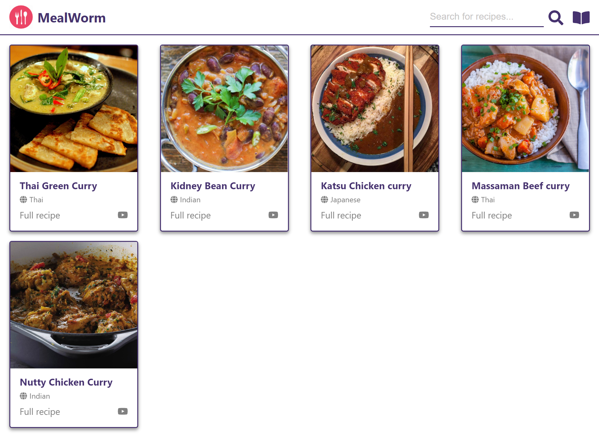

# CHALLENGE NOTES

- Add state and setState logic into the SearchBar component (isOpen)
  - Add conditional rendering so the input field either displays or doesn't based on isOpen === true
- Add state and setState logic into the CardBack component (isFav)
  - Add logic so the solid/hollow heart swap when you click on them (the icons are commented out in the file)

## EXTENSION

- Stop the card from flipping when you click on the heart (will require troubleshooting - research how to stop event propagation)

## Solution screenshot

## Completed branch

state-challenge-solution
